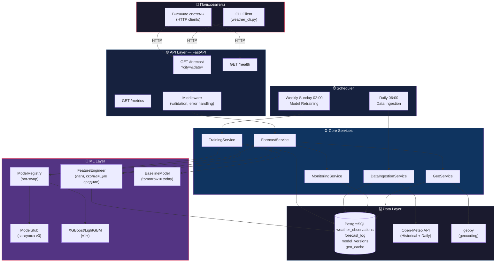
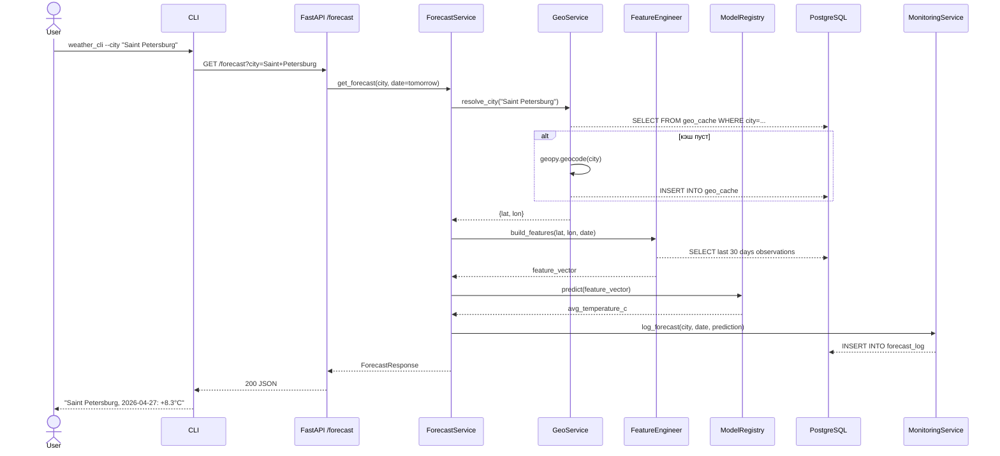
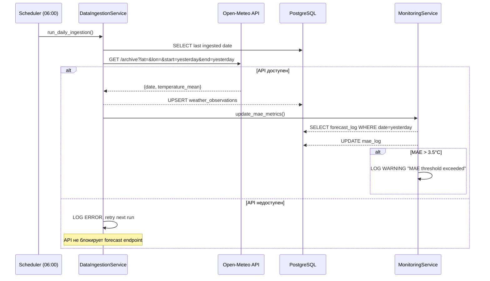
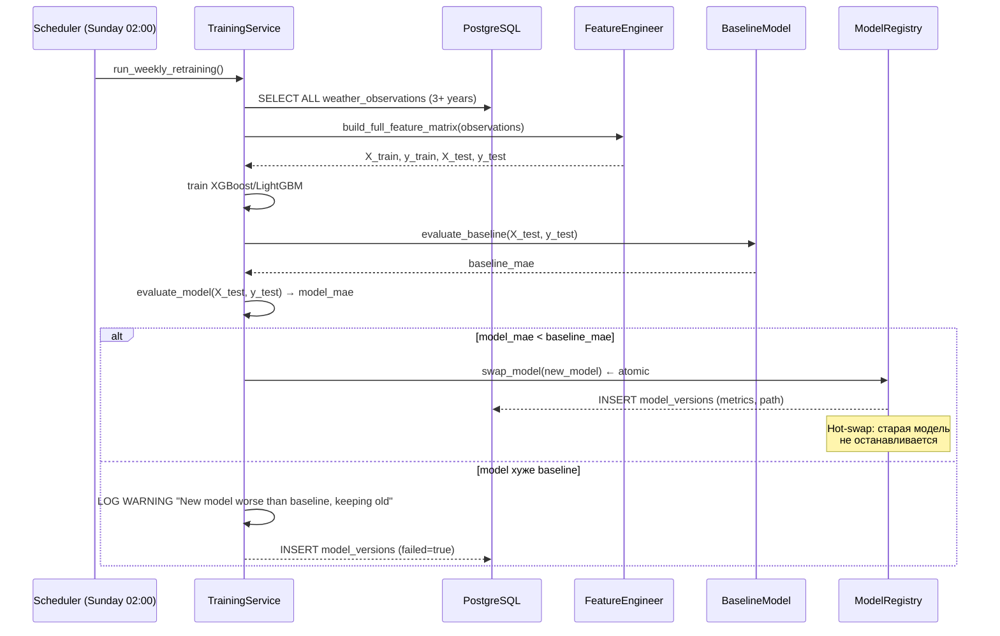
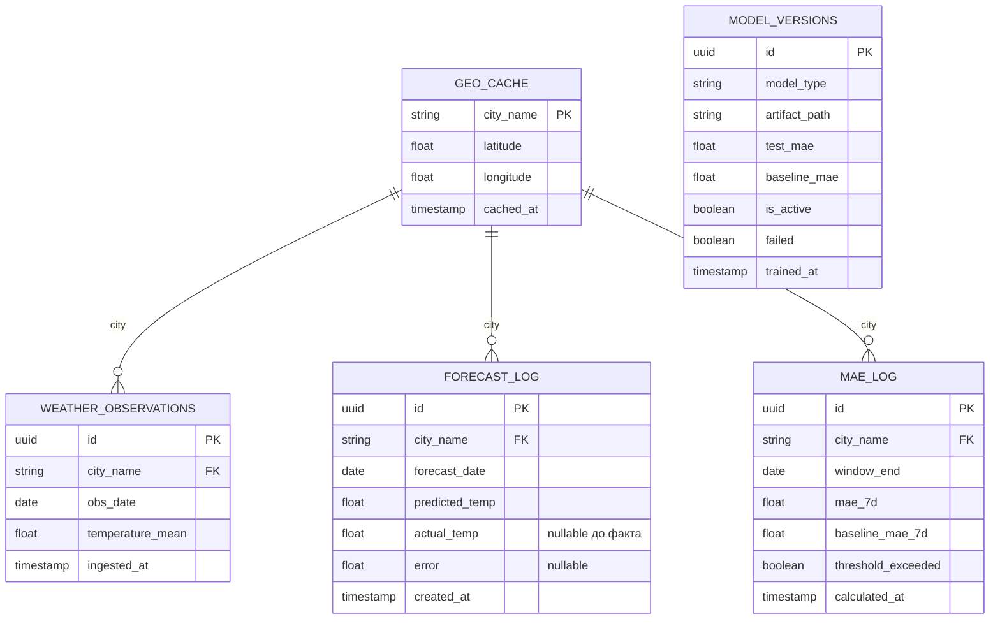

# Weather Forecast System — Architecture

## Процессы системы

| # | Процесс | Триггер | Участники |
|---|---------|---------|-----------|
| P1 | **Forecast Request** | Пользователь / внешняя система | CLI / REST API → ForecastService → ModelRegistry → DB |
| P2 | **Daily Data Ingestion** | Cron 06:00 UTC+3 | Scheduler → Open-Meteo API → DataIngestionService → DB |
| P3 | **Weekly Retraining** | Cron Sunday 02:00 UTC+3 | Scheduler → TrainingService → DB → ModelRegistry |
| P4 | **Model Hot-Swap** | После обучения | TrainingService → ModelRegistry (atomic replace) |
| P5 | **Quality Monitoring** | После каждого прогноза | MonitoringService → DB (MAE log) → Alert (log warning) |
| P6 | **Geo Resolution** | При первом упоминании города | GeoService → geopy → DB (cache) |

---

## Диаграмма компонентов

---

## Диаграмма последовательности — P1: Forecast Request

---

## Диаграмма последовательности — P2: Daily Data Ingestion

---

## Диаграмма последовательности — P3: Weekly Retraining

---

## Схема базы данных

---

## Границы масштабируемости

| Ось | Текущий дизайн (v1) | Предел v1 | Путь масштабирования |
|-----|--------------------|-----------|--------------------|
| Города | 1 (config-driven) | ~50 городов без изменений кода | Партиционирование по city в PG |
| RPS | Single-process FastAPI | ~200 rps (uvicorn, 1 worker) | uvicorn workers / gunicorn |
| Данные | 3 года × 1 город ≈ 1 095 строк | До 10 млн строк в PG без шардинга | TimescaleDB / PG партиции |
| Переобучение | 1 сервер, ~5 сек для 3 лет | До ~100k строк комфортно | Ray / distributed training |
| Горизонт прогноза | +1 день | Расширяется добавлением таргетов | Multi-output регрессия |
| Параметры | Только avg temp | Добавить min/max/precipitation как доп. столбцы | Мультитаргетный XGBoost |
