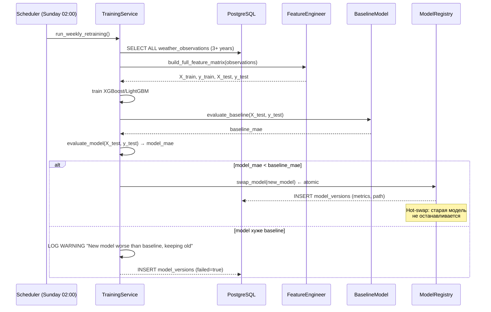

# Диаграмма последовательности — P3: Weekly Retraining

```mermaid
sequenceDiagram
    participant CRON as Scheduler (Sunday 02:00)
    participant TS as TrainingService
    participant DB as PostgreSQL
    participant FE as FeatureEngineer
    participant BL as BaselineModel
    participant MR as ModelRegistry

    CRON->>TS: run_weekly_retraining()
    TS->>DB: SELECT ALL weather_observations (3+ years)
    TS->>FE: build_full_feature_matrix(observations)
    FE-->>TS: X_train, y_train, X_test, y_test

    TS->>TS: train XGBoost/LightGBM
    TS->>BL: evaluate_baseline(X_test, y_test)
    BL-->>TS: baseline_mae

    TS->>TS: evaluate_model(X_test, y_test) → model_mae
    
    alt model_mae < baseline_mae
        TS->>MR: swap_model(new_model)  ← atomic
        MR-->>DB: INSERT model_versions (metrics, path)
        Note over MR: Hot-swap: старая модель<br/>не останавливается
    else model хуже baseline
        TS->>TS: LOG WARNING "New model worse than baseline, keeping old"
        TS-->>DB: INSERT model_versions (failed=true)
    end
```