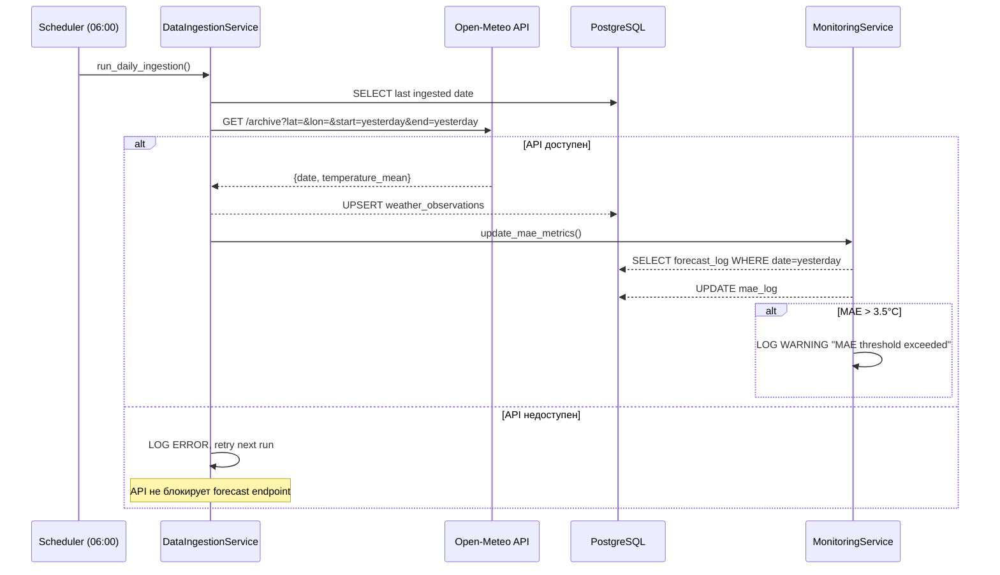

# Диаграмма последовательности — P2: Daily Data Ingestion

```mermaid
sequenceDiagram
    participant CRON as Scheduler (06:00)
    participant DIS as DataIngestionService
    participant OME as Open-Meteo API
    participant DB as PostgreSQL
    participant MON as MonitoringService

    CRON->>DIS: run_daily_ingestion()
    DIS->>DB: SELECT last ingested date
    DIS->>OME: GET /archive?lat=&lon=&start=yesterday&end=yesterday
    
    alt API доступен
        OME-->>DIS: {date, temperature_mean}
        DIS-->>DB: UPSERT weather_observations
        DIS->>MON: update_mae_metrics()
        MON-->>DB: SELECT forecast_log WHERE date=yesterday
        MON-->>DB: UPDATE mae_log
        alt MAE > 3.5°C
            MON->>MON: LOG WARNING "MAE threshold exceeded"
        end
    else API недоступен
        DIS->>DIS: LOG ERROR, retry next run
        Note over DIS: API не блокирует forecast endpoint
    end
```