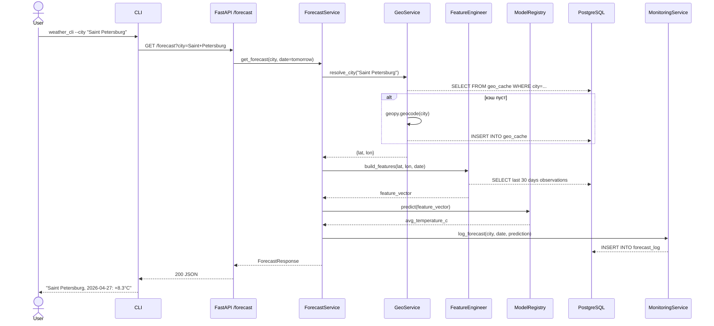

# Диаграмма последовательности — P1: Forecast Request

```mermaid
sequenceDiagram
    actor User
    participant CLI
    participant API as FastAPI /forecast
    participant FS as ForecastService
    participant GS as GeoService
    participant FE as FeatureEngineer
    participant MR as ModelRegistry
    participant DB as PostgreSQL
    participant MON as MonitoringService

    User->>CLI: weather_cli --city "Saint Petersburg"
    CLI->>API: GET /forecast?city=Saint+Petersburg

    API->>FS: get_forecast(city, date=tomorrow)

    FS->>GS: resolve_city("Saint Petersburg")
    GS-->>DB: SELECT FROM geo_cache WHERE city=...
    alt кэш пуст
        GS->>GS: geopy.geocode(city)
        GS-->>DB: INSERT INTO geo_cache
    end
    GS-->>FS: {lat, lon}

    FS->>FE: build_features(lat, lon, date)
    FE-->>DB: SELECT last 30 days observations
    FE-->>FS: feature_vector

    FS->>MR: predict(feature_vector)
    MR-->>FS: avg_temperature_c

    FS->>MON: log_forecast(city, date, prediction)
    MON-->>DB: INSERT INTO forecast_log

    FS-->>API: ForecastResponse
    API-->>CLI: 200 JSON
    CLI-->>User: "Saint Petersburg, 2026-04-27: +8.3°C"
```