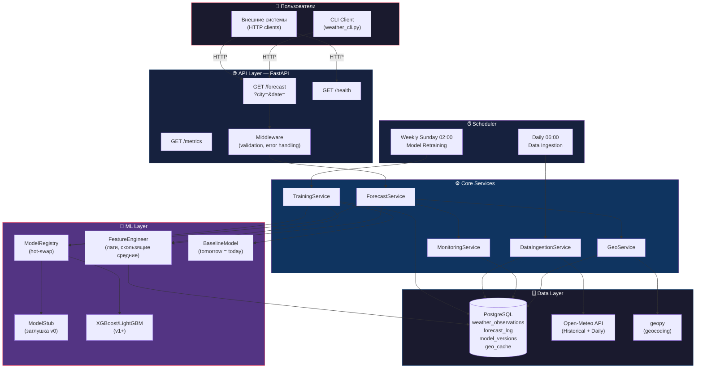

# Диаграмма компонентов

```mermaid
graph TB
    subgraph USER["👤 Пользователи"]
        CLI["CLI Client<br/>(weather_cli.py)"]
        EXT["Внешние системы<br/>(HTTP clients)"]
    end

    subgraph API["🌐 API Layer — FastAPI"]
        EP_FORECAST["GET /forecast<br/>?city=&date="]
        EP_HEALTH["GET /health"]
        EP_METRICS["GET /metrics"]
        MW["Middleware<br/>(validation, error handling)"]
    end

    subgraph CORE["⚙️ Core Services"]
        FS["ForecastService"]
        GS["GeoService"]
        MS["MonitoringService"]
        TS["TrainingService"]
        DIS["DataIngestionService"]
    end

    subgraph ML["🤖 ML Layer"]
        MR["ModelRegistry<br/>(hot-swap)"]
        STUB["ModelStub<br/>(заглушка v0)"]
        XGBM["XGBoost/LightGBM<br/>(v1+)"]
        FE["FeatureEngineer<br/>(лаги, скользящие средние)"]
        BL["BaselineModel<br/>(tomorrow = today)"]
    end

    subgraph DATA["🗄️ Data Layer"]
        PG[("PostgreSQL<br/>weather_observations<br/>forecast_log<br/>model_versions<br/>geo_cache")]
        OME["Open-Meteo API<br/>(Historical + Daily)"]
        GEOPY["geopy<br/>(geocoding)"]
    end

    subgraph SCHED["⏰ Scheduler"]
        CRON_D["Daily 06:00<br/>Data Ingestion"]
        CRON_W["Weekly Sunday 02:00<br/>Model Retraining"]
    end

    CLI -->|HTTP| EP_FORECAST
    EXT -->|HTTP| EP_FORECAST
    EXT -->|HTTP| EP_HEALTH

    EP_FORECAST --> MW
    MW --> FS
    FS --> GS
    FS --> MR
    FS --> FE
    FS --> MS

    GS --> GEOPY
    GS --> PG

    MR --> STUB
    MR --> XGBM

    FE --> PG

    MS --> PG

    CRON_D --> DIS
    DIS --> OME
    DIS --> PG

    CRON_W --> TS
    TS --> PG
    TS --> FE
    TS --> MR
    TS --> BL

    style USER fill:#1a1a2e,stroke:#e94560,color:#fff
    style API fill:#16213e,stroke:#0f3460,color:#fff
    style CORE fill:#0f3460,stroke:#533483,color:#fff
    style ML fill:#533483,stroke:#e94560,color:#fff
    style DATA fill:#1a1a2e,stroke:#0f3460,color:#fff
    style SCHED fill:#16213e,stroke:#533483,color:#fff
```