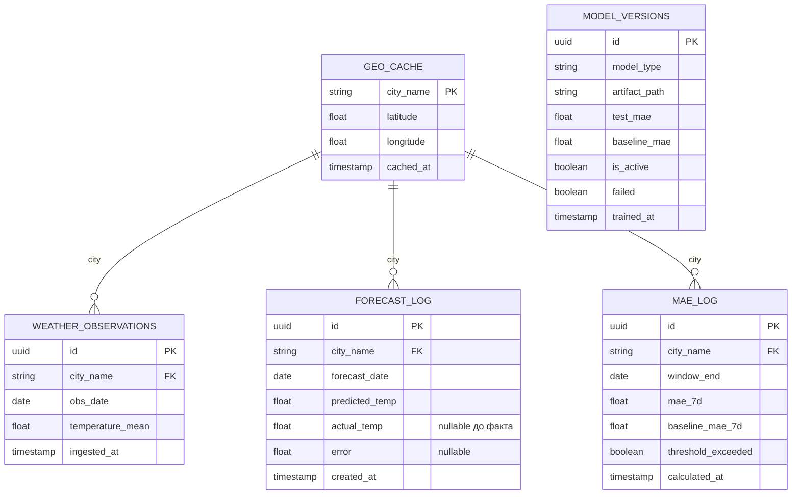

# Схема базы данных

```mermaid
erDiagram
    GEO_CACHE {
        string city_name PK
        float latitude
        float longitude
        timestamp cached_at
    }

    WEATHER_OBSERVATIONS {
        uuid id PK
        string city_name FK
        date obs_date
        float temperature_mean
        timestamp ingested_at
    }

    FORECAST_LOG {
        uuid id PK
        string city_name FK
        date forecast_date
        float predicted_temp
        float actual_temp "nullable до факта"
        float error "nullable"
        timestamp created_at
    }

    MAE_LOG {
        uuid id PK
        string city_name FK
        date window_end
        float mae_7d
        float baseline_mae_7d
        boolean threshold_exceeded
        timestamp calculated_at
    }

    MODEL_VERSIONS {
        uuid id PK
        string model_type
        string artifact_path
        float test_mae
        float baseline_mae
        boolean is_active
        boolean failed
        timestamp trained_at
    }

    GEO_CACHE ||--o{ WEATHER_OBSERVATIONS : "city"
    GEO_CACHE ||--o{ FORECAST_LOG : "city"
    GEO_CACHE ||--o{ MAE_LOG : "city"
```