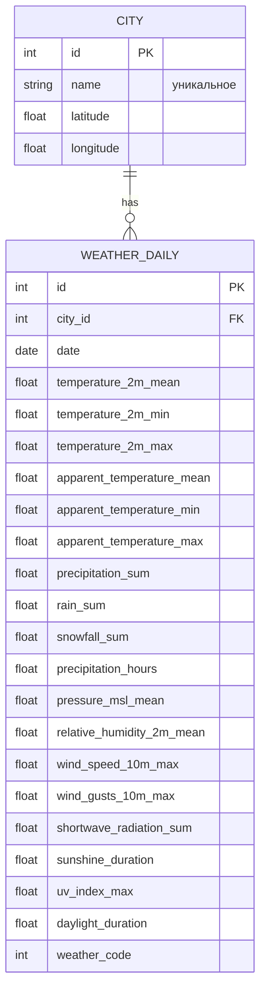

# Схема базы данных

```mermaid
erDiagram
    CITY {
        int id PK
        string name "уникальное"
        float latitude
        float longitude
    }

    WEATHER_DAILY {
        int id PK
        int city_id FK
        date date
        float temperature_2m_mean
        float temperature_2m_min
        float temperature_2m_max
        float apparent_temperature_mean
        float apparent_temperature_min
        float apparent_temperature_max
        float precipitation_sum
        float rain_sum
        float snowfall_sum
        float precipitation_hours
        float pressure_msl_mean
        float relative_humidity_2m_mean
        float wind_speed_10m_max
        float wind_gusts_10m_max
        float shortwave_radiation_sum
        float sunshine_duration
        float uv_index_max
        float daylight_duration
        int weather_code
    }

    CITY ||--o{ WEATHER_DAILY : "has"
```